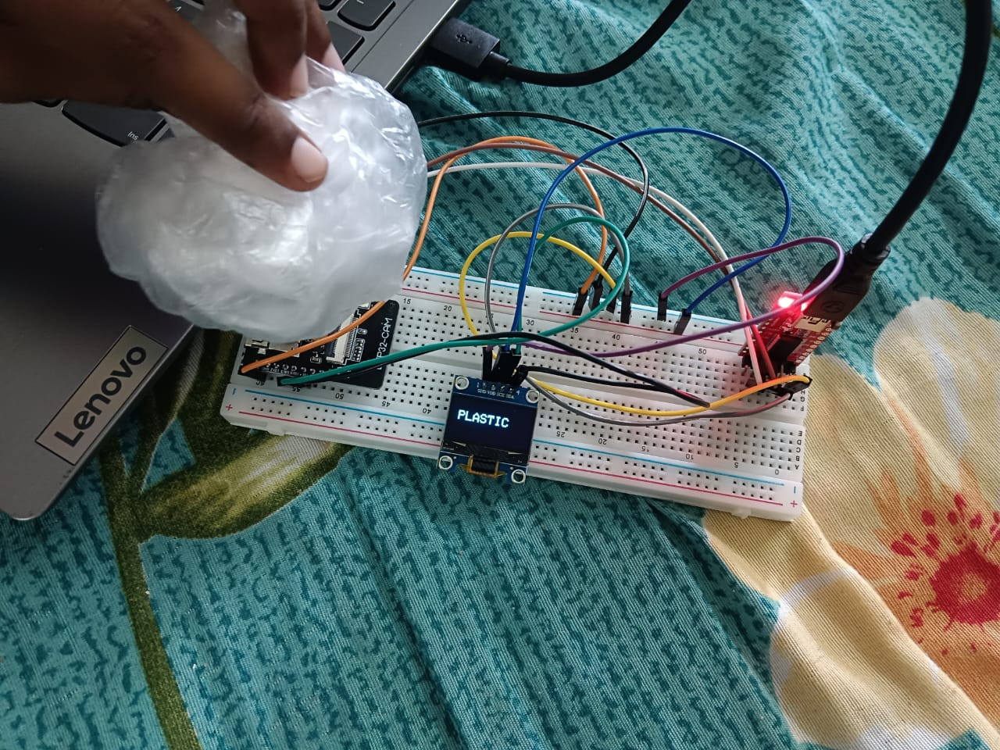
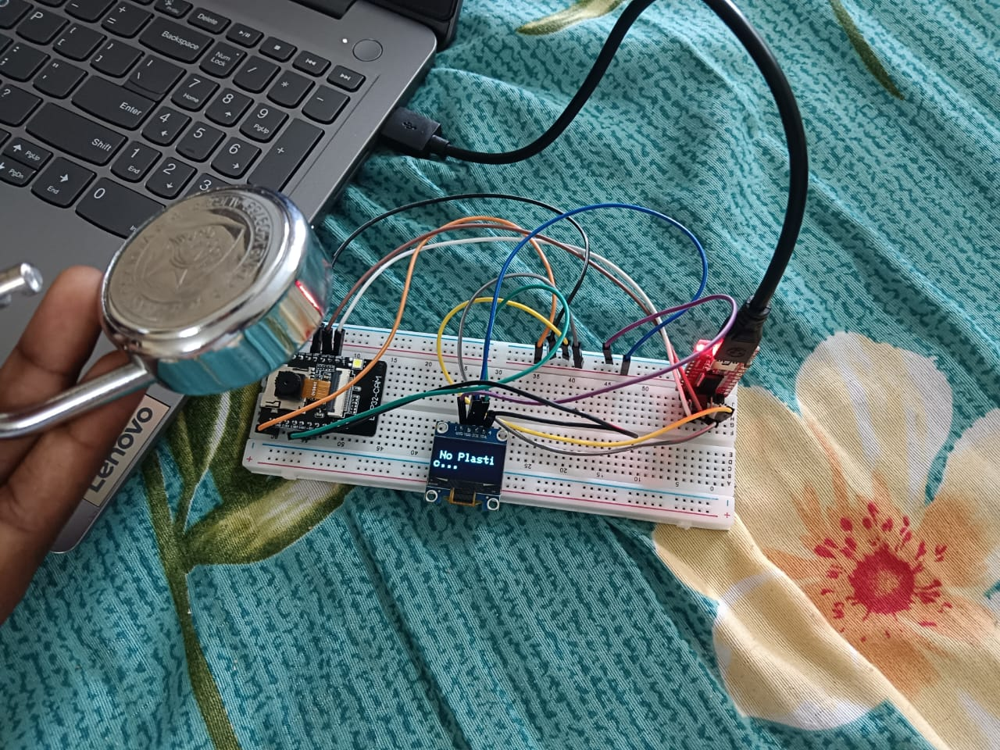
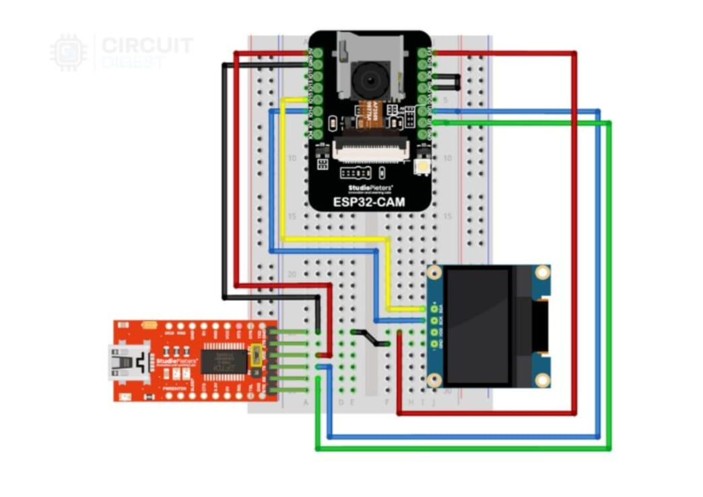

# plastic-detection-esp32-cam
Plastic detection using ESP32-CAM, Edge Impulse, and ML
# 🔍 Plastic Detection using ESP32-CAM and Edge Impulse

This project is an **IoT-based real-time plastic detection system** built using the **ESP32-CAM**, **Edge Impulse (Machine Learning)**, and an **OLED display**. It classifies objects as **Plastic** or **Non-Plastic** and shows the result instantly on the screen.

---

## 📸 Demo Output

> *Plastic and non-plastic detection results shown on OLED display.*

---

## 🧠 Machine Learning Model

- **Platform**: Edge Impulse
- **Model**: Convolutional Neural Network (CNN)
- **Data**: Custom images of plastic and non-plastic items
- **Export Format**: Arduino Library (.zip) for on-device inference

---

## 🔌 Circuit Diagram

> *ESP32-CAM connected to OLED (SSD1306) using I2C.*

---

## 🛠️ Components Used

- ESP32-CAM module (with OV2640 camera)
- SSD1306 OLED Display (128x64, I2C)
- Arduino IDE
- Edge Impulse Studio
- Python (for data preprocessing & testing)

---

## ⚙️ How It Works

1. **Capture**: ESP32-CAM takes a photo of an object.
2. **Infer**: The image is sent to a CNN model trained using Edge Impulse.
3. **Display**: The result is shown on the OLED screen:  
   - "Plastic Detected"  
   - "Non Plastic"

---

## 📁 Project Structure
plastic-detection-esp32-cam/
├── images/ # Output photos & circuit diagram
├── code/ # Arduino code files (.ino, .h, etc.)
├── model/ # Edge Impulse model files (.zip)
├── README.md

---

## 🔧 Circuit Connections

| OLED Pin | ESP32-CAM Pin |
|----------|---------------|
| VCC      | 3.3V          |
| GND      | GND           |
| SDA      | GPIO 14       |
| SCL      | GPIO 15       |

---

## 🚀 Setup Instructions

1. Train your model in [Edge Impulse Studio](https://studio.edgeimpulse.com/)
2. Download the **Arduino library export (.zip)**
3. Import it into Arduino IDE via **Sketch > Include Library > Add .ZIP Library**
4. Connect ESP32-CAM and upload the code
5. Connect the OLED and run the system to view results!

---

## 🌱 Applications

- Smart waste bins (automated plastic sorting)
- Recycling centers and plants
- Smart cities and environmental monitoring
- Home automation for waste segregation
- Education kits on AI + IoT integration

---

## 📚 References

- [Edge Impulse Documentation](https://docs.edgeimpulse.com)
- [ESP32-CAM Setup Guide](https://github.com/espressif/arduino-esp32)
- [Adafruit SSD1306 OLED Guide](https://learn.adafruit.com/monochrome-oled-breakouts)
- A. Ilyas, R. Ahmad, & M. Khan (2021). *AI-Based Smart Waste Classification*. IJEST, 18(9), 2675–2684.
- S. R. Jaiswal & A. Kumar (2020). *IoT-Based Smart Waste Management System*. IEEE SmartTechCon.

---

---
  

